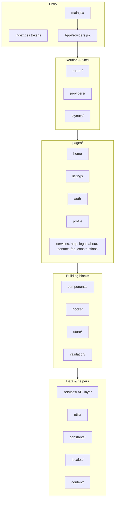

# Architecture Overview

Sahm Real Estate Frontend is a **Layer-Based React SPA**: one application organized by technical layer (pages, components, services, store) instead of by business domain.

**Why Layer-Based?** The folder name tells you exactly what kind of code lives inside. No cross-feature import rules to memorize — just a simple top-down dependency direction.

---

## Layer diagram

---

## Dependency rules

| Rule | Detail |
|------|--------|
| **Direction** | `pages → components / hooks / store → services → utils` — top-down only |
| **Pages** | Compose components + hooks; no direct HTTP, no heavy logic |
| **Components** | Never import from `pages/`; presentational + reusable |
| **HTTP** | Only via `src/services/*Service.js` → `apiClient.js` — never raw `fetch` in UI |
| **Global state** | Redux for shared app state only; forms use React Hook Form |
| **Async data** | `createAsyncThunk` — **no RTK Query** |
| **Routing** | Lazy-loaded pages; route paths in `src/constants/routes.js` |
| **i18n** | All user-visible strings via i18next keys |
| **RTL** | Logical CSS (`ps-`, `pe-`, `ms-`, `me-`) — never `pl-`/`pr-` |
| **Auth** | JWT **Bearer** token; persist in **`localStorage`** (`sahm_token`) |

---

## Application shells

Two layout compositions (+ auth uses MainLayout):

| Layout | Used for |
|--------|----------|
| `MainLayout` | **All public pages** including Home — `GuestTopBar` or `AuthenticatedTopBar` + Navbar + Breadcrumb + Footer |
| `DashboardLayout` | Profile — `MainLayout` + `ProfileSidebar` |

**No separate Home layout or social bar.** Home uses the same top bar as every other public page.

Login & Register render inside `MainLayout` with a centered form.

---

## Cross-cutting concerns

| Concern | Location |
|---------|----------|
| Auth token + 401 | `services/apiClient.js` + `store/slices/authSlice.js` |
| Locale + direction | `hooks/useLocale.js` + `locales/` |
| Route guards | `router/ProtectedRoute.jsx` |
| Errors | `services/ApiError.js` + `providers/ErrorBoundary.jsx` |
| Toasts | `components/ui/Toast` |

---

## Backend integration

- REST API, mostly **FormData** on POST.
- Base URL: `VITE_API_BASE_URL` (see `.env.example`).
- Header: `Lang: ar | en` on requests.
- Auth: `Authorization: Bearer <token>`.
- Reference: [endpoint-map.md](../api/endpoint-map.md).

**Static pages (no API body):** Help, Privacy, Terms, Blacklist.  
**Dynamic:** About (`GET /about`), FAQ TBD — see [decisions.md](./decisions.md) OPEN-01.

---

## Implementation status

All pages, layouts, components, services, and the Redux auth slice are implemented under `src/` following this architecture.

**Current data source:** the service façade in `src/services/index.js` exports the mock services from `src/mocks/` — flip the exports to the real `*.service.js` modules when the backend is available. Interfaces and response shapes are identical, so no UI or logic changes are required.

---

## Related docs

- [folder-structure.md](./folder-structure.md)
- [decisions.md](./decisions.md)
- [endpoint-map.md](../api/endpoint-map.md)
